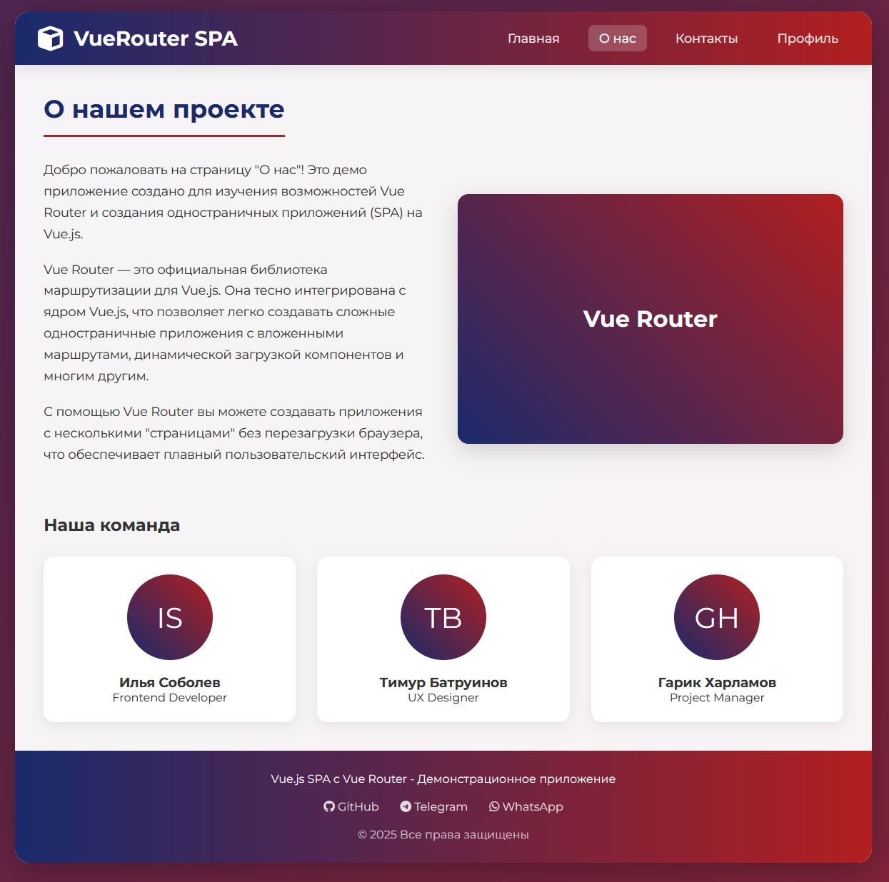
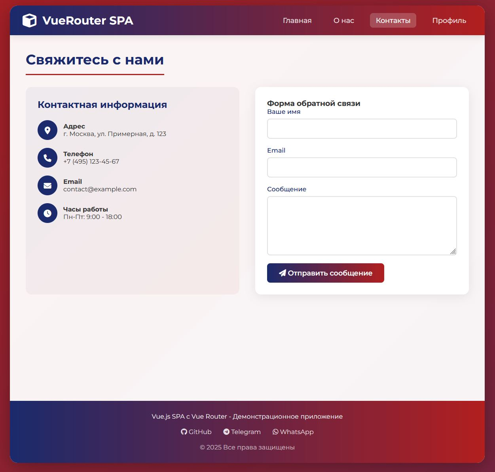
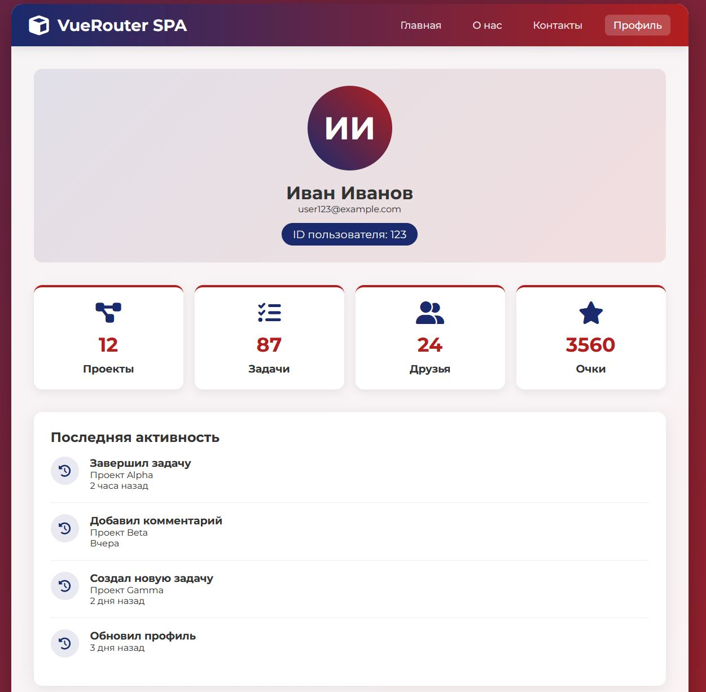

# 🌟 __Vue.js SPA with Vue Router__

| | | | | | | |
|-|-|-|-|-|-|-|
|  |  |  |  |  |  |  |

<table align="center">
  <tr>
    <td></td>
    <td></td>
    <td></td>
    <td></td>
  </tr>
</table>

Это демонстрационное одностраничное приложение (SPA), созданное с использованием Vue.js 3 и Vue Router 4, которое показывает основные возможности маршрутизации в Vue-приложениях.

##  🚀 __Особенности__

    🏠 Главная страница с приветствием и основными возможностями

    ℹ️ Страница "О нас" с информацией о проекте и командой

    📧 Контактная форма с валидацией и обработкой

    👤 Динамический профиль пользователя с параметризованным маршрутом

    ✨ Анимации переходов между страницами

    📱 Полностью адаптивный дизайн для всех устройств

    🎨 Современный UI с градиентами и анимациями


## 📂 __Структура проекта__

```
├── index.html             # Основной HTML файл
├── src/
│   ├── app.js             # Основное приложение Vue
│   ├── router.js          # Конфигурация маршрутизатора
│   ├── components/        # Компоненты приложения
│   │   ├── AboutPage.js   # Страница "О нас"
│   │   ├── ContactPage.js # Контактная страница
│   │   ├── Footer.js      # Футер приложения
│   │   ├── HomePage.js    # Главная страница
│   │   ├── NavBar.js      # Навигационная панель
│   │   └── UserProfile.js # Профиль пользователя
└── styles.css             # Основные стили приложения
```

## 🎨 __Стили и дизайн__

__Приложение использует:__

    Красивые градиентные фоны с анимацией

    Современные карточки с эффектами при наведении

    Адаптивную сетку для всех устройств

    Плавные переходы между страницами

    Семантическую цветовую схему

## 🚀 __Запуск приложения__

Просто откройте файл index.html в браузере - никакой дополнительной сборки не требуется!
